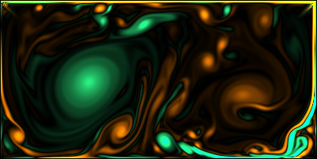
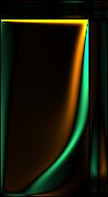
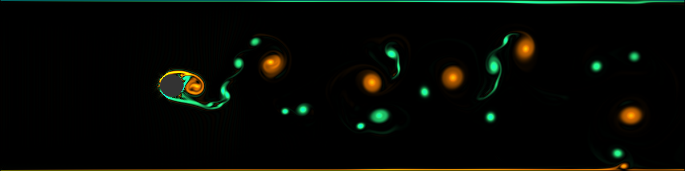
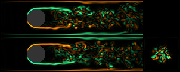

# clbmtaichi - LBM on Taichi

This repository shares a lattice Boltzmann[Chen1998] solver which is accelerated with [Taichi-Lang](https://www.taichi-lang.org/). Taichi enhances developmenet of Python-based parallel computing programs. Its multiplatform nature realizes a great portability, and developers do not have to consider device-dependent optimization. The author learned Taichi implementation for LBM from the repository published by Dr. Zhuo Wang [LBM_Taichi](https://github.com/hietwll/LBM_Taichi). His LBM code (only 200 lines for von Karman vortex streen behind a circular object!) is exhibited in the Taichi gallery. Our project shared here is still simple, meaning that it possesses fundamental functions only, and is not suitable for neither industrial nor research purposes. However, it can, hopefully, have values from an educational point of view for those who want to understand the fundamentals and implmentation of LBM from scratch. 

Features of the code are: 
- [SoA (Structure of Array) data layout](docs/tips.md)
- [Sympy CSE (Common Subexpression Elimination) optimization](docs/kernels.md)
- [Model pool: BGK, TRT, non-orthogonal MRT, Cumulant](docs/models.md)
- [D2Q9 and D3Q27 discrete velocity models](docs/models.md)


## Installation

### Environment

The codes within this repository were developed using Macbook Air Apple Silicon M2 2022, and an Anaconda virtual environment was used. 


### Prepare virtual environment

Anaconda virtual environment can be recommended to prevent affecting your syste. After installation of `Anaconda3`, make your own environment for `lbmtaichi` by 

```bash
conda create -n taichi_env python=3.10 -y
conda activate taichi_env
```

In the virtual environment ([!NOTE] after installation of Taichi), 
```
ti
```
shows `[Taichi] version 1.7.4, llvm 15.0.7, osx, python 3.10.20`

The portability of the code was confirmed for `cuda` on RTX A4500. 

### Clone repository and install required packages


The project requires `numpy`, `sympy` and `taichi` libraries. They can be installed by making use of `requirements.txt`. 

```bash
git clone https://github.com/hayashi-workshop/clbmtaichi.git
cd clbmtaichi
export REPO_PATH=$(pwd)
pip install -r requirements.txt
```

After installation, I recommend taking a glance at Taichi sample gallery. 

```bash
ti gallery
```

You will find von Karman vortex stream by Dr. Wang on the gallery tile. Clicking the sambnail invokes the simulation and the corresponding sample code will appear in the terminal. In my environment, the Taichi sample files can be found in 

```bash
cd /opt/anaconda3/envs/taichi_env/lib/python3.1/site-packages/taichi/examples/simulation
```


## Run simulator

```bash
cd $REPO_PATH
python main.py run
```

2D/3D (specified by domain size `nd`), Reynolds number, and rendering mode can be changed by throwing them in `args`, for example,  

```bash
python main.py run --nd 1001 301 --Re 1000 --render velocity
```


### Docs

- Notes of [LB equations](docs/models.md)
- [Kernel description](docs/kernels.md)
- Some coding tips are listed [here](docs/tips.md)
- Cumulants and moment expressions can be derived in an interactive way via [Jupyter Notebook](generator/cumulant_moment_exprs.ipynb). Open this notebook in your environment with `sympy`: 

```bash
cd $REPO_PATH/generator/
jupyter notebook cumulant_moment_exprs.ipynb
```


### Samples

Here, some examples are exhibited for quick look. Please see [other samples](samples/samples.md).

#### Lid-driven cavity flows

```
cd $REPO_PATH
PYTHONPATH=. python samples/cavity2d.py
```

Lattice points: 401x201; Re=500000; u=0.1
The top wall is moving right. 




```
cd $REPO_PATH
PYTHONPATH=. python samples/cavity3d.py
```
Lattice points: 101x201x21; Re=5000; u=0.1
The top wall is moving right. The four panels show vorticity components in xy (lower-left), xz (upper-left), zy (lower-right), and yz (upper-right) palnes. 




#### Flow past a cylinder/sphere

```
cd $REPO_PATH
PYTHONPATH=. python samples/object2d.py
```
Lattice points: 1201x301; Re=100000; u=0.01




```
cd $REPO_PATH
PYTHONPATH=. python samples/object3d.py
```
Lattice points: 241x61x61; Re=10000; u=0.1
The simulation dumps .vtr file for Paraview. 




## More fundamentals / the state-of-the arts of LBM open libs.

Readers those who need a solution for practical problems are recommended visiting
1. [lbmpy](https://pycodegen.pages.i10git.cs.fau.de/lbmpy/)
2. [VirtualFluids](https://zenodo.org/records/10535097)
3. [Palabos](https://palabos.unige.ch/get-started/lattice-boltzmann/what-lattice-boltzmann)
4. [OpenLB](https://www.openlb.net/)

YouTube lectures (highly recommended)
1. [Short lecture by Prof. Kruger](https://www.youtube.com/watch?v=jfk4feD7rFQ)
2. [Great lecture series by TUBS-IRMB](https://www.youtube.com/@tubs-irmb6980/videos)


## Acknowledgments
This implementation is inspired by the elegant and concise LBM approach presented in [LBM_Taichi](https://github.com/hietwll/LBM_Taichi). I would like to express my sincere respect for their work, which achieved high-performance parallel computation in such a compact and readable design. My implementation builds upon this foundation, extending it to support multi-dimensional scalability and moment-based collision kernels via SymPy-based JIT code generation and SoA memory layouts. Intermediate variable in cumulant kernel naming conventions for moment transformations were inspired by [lbmpy](https://pycodegen.pages.i10git.cs.fau.de/lbmpy/). 

## References 

- [Chen1998] Shiyi Chen and G. Doolen, LATTICE BOLTZMANN METHOD FOR FLUID FLOWS. Annual Review of Fluid Mechanics. (1998) 30: 329-364.
- [TK2017] Timm Kruger et al., The Lattice Boltzmann Method. Principles and Practice, (2017) Springer: Very detailed in math, phys, and coding techniques. 
- [TS2021] Takeshi Seta, Lattice Boltzmann Method. (2021) Morikita Publishing (in Japanese): Hands-on introduction of LBM. (written in Japanese)


