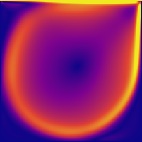
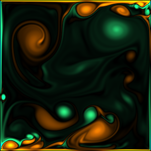
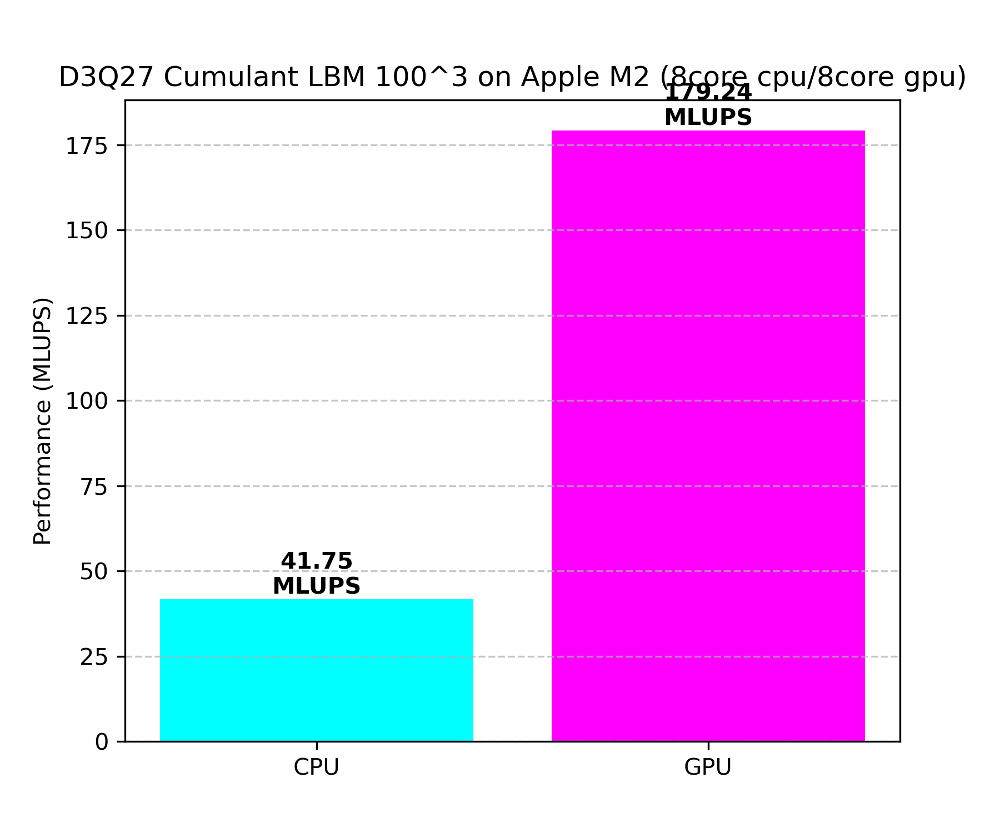
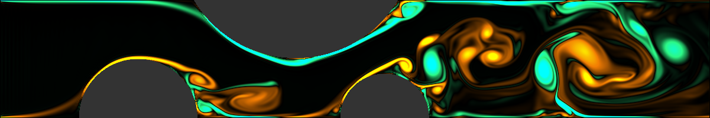
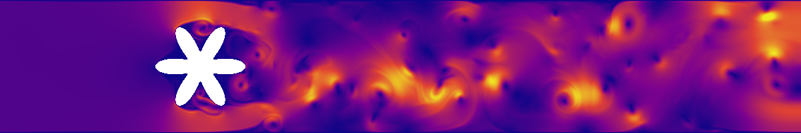
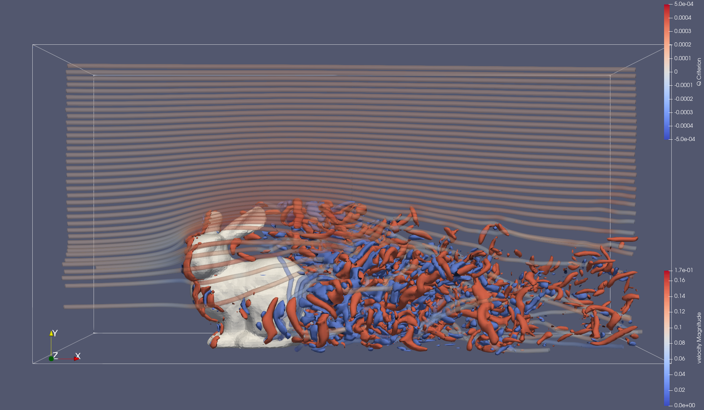
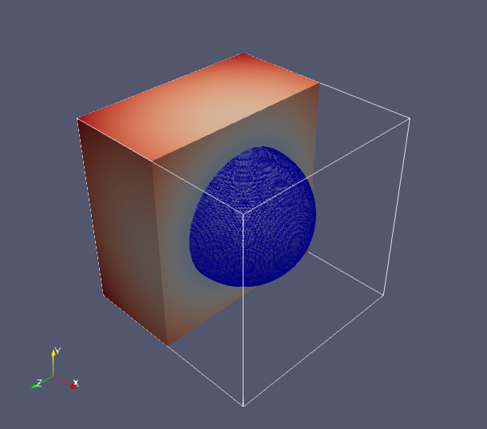

# Examples

## Flow past a cylinder

```bash
cd $REPO_PATH
PYTHONPATH=. python examples/object2d.py
```

Use `PYTHONPATH=.` to solve the library paths for examples/*.py launched from root dir. 

## Flow past a sphere

```bash
cd $REPO_PATH
PYTHONPATH=. python examples/object3d.py
```

## Lid-driven catity

```bash
cd $REPO_PATH
PYTHONPATH=. python examples/cavity2d.py
```

```bash
cd $REPO_PATH
PYTHONPATH=. python examples/cavity3d.py
```

## Change domain size

Let us try the standard square cavity flow. Copy the cavity flow example as [`cavity2d_std.py`](./cavity2d_std.py)

```bash
cp examples/cavity2d.py examples/cavity2d_std.py
```

Open the copied file to change some conditions: 

```bash
nano examples/cavity2d_std.py
```

- Cavity size (201, 201)
- Re=5000
- some rendering conditions to draw velocity magnitude contour
- MRT kernel

```python
nd = (201, 201)
u, Re = 0.01, 5000.0
...

from lb_solver.d2q9_MRT_kernel import ModelConfig
...

renderer = FluidRenderer(lbm, vmin=0., vmax=u*0.5) # Taichi realtime rendering #
...

    renderer.render(lbm, mode="velocity")
```

Save the file; then, 

```bash
PYTHONPATH=. python examples/cavity2d_std.py
```




## Change boundary condition

```bash
cp examples/cavity2d_std.py examples/cavity2d_std_bc.py
nano examples/cavity2d_std_bc.py
```

Change the following:
- Domain size
- u and Re
- Cumulant $\delta \rho$ mode
- Boundary velocities
- Rendering params `vmin` `vmax`
- Rendering mode: set back to "vorticity".

```python
nd = (301, 301)
u, Re = 0.1, 50000.0
...
from lb_solver.d2q9_Cumulant_drho_kernel import ModelConfig
...
bc_manager = BoundaryManager(nd, [2, 2, 2, 2], [ [0, -u*0.5], [0,u*0.5], [-u,0], [u,0] ])

renderer = FluidRenderer(lbm, vmin=-u*0.5, vmax=u*0.5) # Taichi realtime rendering #

while renderer.window.running and step < step_end:
    for _ in range(500):
    ...
    renderer.render(lbm, mode="vorticity")
```




## MLUPS monitoring

MLUPS is (total number of lattice units updated per seond)/10^6. `PerformanceMonitor` class in `lb_utils/lbm_utils.py` provides a simple MLUPS measure. As implemented in [`examples/object2d.py`](./object2d.py), instantiate a class object (`mlups_monitor`) and add one line `mlpus_monitor.update(step)` in the time loop. 

```python
from lb_utils.lbm_utils import PerformanceMonitor
...

mlups_monitor = PerformanceMonitor(nd)
...
while renderer.window.running and step < step_end:
    for _ in range(100):
        ...
        step += 1

    mlups_monitor.update(step)
```


## GPU vs CPU

One of the attractive features of [Taichi](https://www.taichi-lang.org/) is its portability. No need to modify the code to migrate from a gpu to a cpu environment. Apple Silicon M2 used in the code development possesses 8 cpu cores (4 efficient, 4 performance) and 8 gpu cores. `examples/mlups_main.py` compares MLUPS with the M2 gpu and cpu for 100x100x100 cavity flow simulation. 

```bash
cd $REPO_PATH
PYTHONPATH=. python examples/mlups_main.py
```

</img>


## Bumpy channel (trick with cylinders)

[`examples/bumpy.py`](./bumpy.py) shows a multiple object case. Three cylinders are set on the channel wall to mimic bumpy channel geometry. For this purpose, `ObjectManager` classs is rewritten in `examples/object_bump.py`. 

1201x201; Re=5000; u=0.01, Cumulant ($\delta \rho$ mode)



## Using Paraview

`pyevtk` allows you to dump simulation results in `vtk`/`vtr` for Paraview visualiation. Find an example how to dump field data with `pyevtk` in [`main.py`](../main.py): 

```python
from lb_utils.lbm_utils import save_vtk

...

    while renderer.window.running and step < step_end:
        ...

        if step % output_step and output_flag:
            save_vtk(lbm, step, output_dir)
```

## Irregular shape

### Johansen-Collela

```bash
cd $REPO_PATH
PYTHONPATH=. python examples/JCprob1.py
```

A star-like shape in [JC1998] as embedded solid boundary. See [examples/JCprob1.py](../examples/JCprob1.py). 



The narrow gaps between the object and the wall causes strong vortical motion, for which the naive outlet boundary treatment can be dangerous and simulations may face a challenge for stability! 

[JC1998] Johansen and Colella. Journal of Computational Physics, 147(1):60–85, 1998.

### Stanford bunny

[Stanford bunny](https://graphics.stanford.edu/data/3Dscanrep/) in a duct. 

Polygon model@[trimesh repo](https://github.com/mikedh/trimesh) is used to set mask field (see [`examples/obstacle_stanford_bunny.py`](./obstacle_stanford_bunny.py)). In order to use trimesh, install the following packages to your virtual environment: 

```bash
pip install 'trimesh[easy]'
pip install networkx
```

Then, 

```bash
cd $REPO_PATH
PYTHONPATH=. python examples/stanford_bunny.py
```

(241, 121, 121); length_scale = 60; offset = (50, 0, 30) (corner edige of model bounding box); (u, Re) = (0.1, 40000)

</img>


## Extracting isosurfaces

### Marching cube

- MarchingCube class: [`lb_utils/marching_cube.py`](../lb_utils/marching_cube.py)
- Surface extraction example [`examples/mcube_extra_surface.py`](./examples/mcube_extra_surface.py)

</img>


### Extract Q-criterion isosurfaces using marching cube

Compute and export Q-criterion [`examples/mcube_stanford_bunny.py`](./examples/mcube_stanford_bunny.py)

<video src="https://github.com/user-attachments/assets/7befea58-1075-4156-aa99-1c69275f05b4" width="600" autoplay loop muted playsinline></video>


